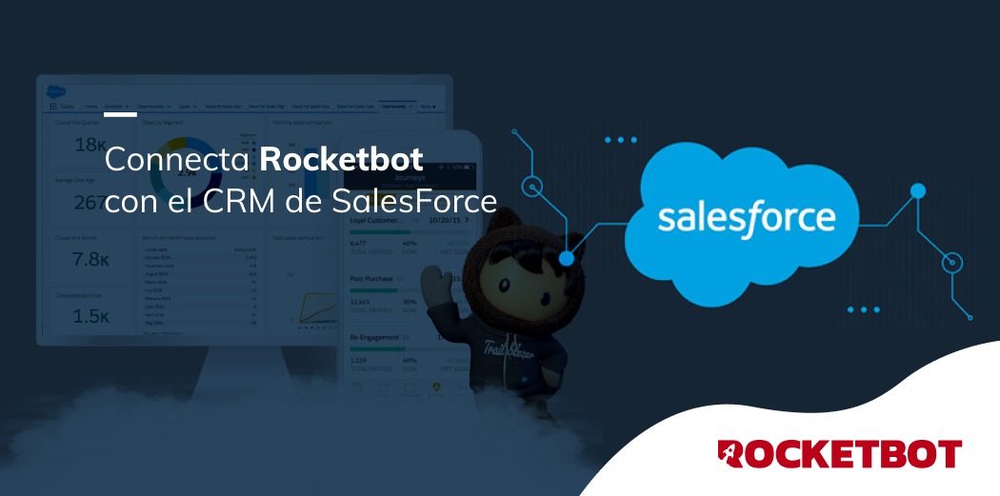

# Salesforce
  
Interact with the Salesforce's ecosystem.  
  

## How to install this module
  
__Download__ and __install__ the content in 'modules' folder in Rocketbot path  

## How to use this module
  
Before using this module, you will need from SalesForce:

 * Username.
 * Password.
 * 
Consumer Key (obtains from App Manager | Setup -> App Manager -> "View" to your API app).
 * Consumer Secret (obtains 
from App Manager | Setup -> App Manager -> "View" to your API app).
 * Security Token (obtains from My Personal 
Information | Profile -> Settings -> Reset My Security Token).

## Description of the commands

### Connects to Salesforce
  
Enable the conection to Salesforce
|Parameters|Description|example|
| --- | --- | --- |
|Username||username|
|Password||********|
|client_id||3MVG9ayzKZt5EleHsI9aFM|
|client_secret||E6F1E861EED2E92DB0DA70131307C738D91|
|token||4Tl3VbIRSYMNTs4|
|domain||rocketbot.my|
|Assign result to variable||Variable|

### Get resources list
  
Obtains the list of resources from Salesforce
|Parameters|Description|example|
| --- | --- | --- |
|Assign result to variable||Variable|

### Get objects list
  
Obtains the list of objects from Salesforce
|Parameters|Description|example|
| --- | --- | --- |
|Resource to use||sobjects|
|Assign result to variable||Variable|

### Get metadata
  
Obtains the object's metadata from Salesforce
|Parameters|Description|example|
| --- | --- | --- |
|Resource to use||sobjects|
|Object to use||Account|
|Assign result to variable||Variable|

### Create a record
  
Allows you to create a record in SalesForce
|Parameters|Description|example|
| --- | --- | --- |
|Resource to use||sobjects|
|Object to use||Account|
|Data to assign to the record||data|
|Assign result to variable||Variable|

### Update a record
  
Allows you to update a record in SalesForce
|Parameters|Description|example|
| --- | --- | --- |
|Resource to use||sobjects|
|Object to use||Account|
|Record to modify||001D000000INjVe|
|Data to assign to the record||data|
|Assign result to variable||Variable|

### Delete a record
  
Allows you to delete a record in SalesForce
|Parameters|Description|example|
| --- | --- | --- |
|Resource to use||sobjects|
|Object to use||Account|
|Record to delete||001D000000INjVe|
|Assign result to variable||Variable|

### Query of fields
  
Allows you to get fields from a record in SalesForce
|Parameters|Description|example|
| --- | --- | --- |
|Resource to use||sobjects|
|Object to use||Account|
|Record to consult||001D000000INjVe|
|Fields||Account,Name,Date|
|Assign result to variable||Variable|
