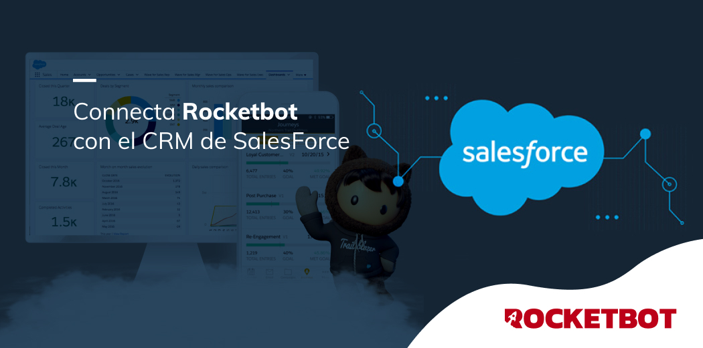

# Salesforce
  
Interaja com o ecossistema do Salesforce.  
  

## Como instalar este módulo
  
__Baixe__ e __instale__ o conteúdo na pasta 'modules' no caminho do Rocketbot  

## Como usar este módulo
  
Antes de usar este módulo, você precisará do SalesForce:

 * Username.
 * Password.
 * Consumer Key (é obtido de App Manager | Setup -> App Manager -> "Visualizar" seu aplicativo de API).
 * Consumer Secret (é obtido de App Manager | Setup -> App Manager -> "Visualizar" seu aplicativo de API).
 * Security Token (é obtido de My Personal Information | Profile -> Settings -> Reiniciar My Security Token).

## Descrição do comando

### Conecte ao Salesforce
  
Conecte sua conta do Salesforce
|Parâmetros|Descrição|exemplo|
| --- | --- | --- |
|Username||username|
|Password||********|
|client_id||3MVG9ayzKZt5EleHsI9aFM|
|client_secret||E6F1E861EED2E92DB0DA70131307C738D91|
|token||4Tl3VbIRSYMNTs4|
|domain||rocketbot.my|
|Atribuir resultado à variável||Variável|

### Obter lista de recursos
  
Obtém a lista de recursos do Salesforce
|Parâmetros|Descrição|exemplo|
| --- | --- | --- |
|Atribuir resultado à variável||Variável|

### Obter lista de objetos
  
Obtém a lista de objetos Salesforce
|Parâmetros|Descrição|exemplo|
| --- | --- | --- |
|Recurso para usar||sobjects|
|Atribuir resultado à variável||Variável|

### Obter metadata
  
Obter metadados de objetos do Salesforce
|Parâmetros|Descrição|exemplo|
| --- | --- | --- |
|Recurso para usar||sobjects|
|Objeto a ser usado||Account|
|Atribuir resultado à variável||Variável|

### Criar um registro
  
Permite criar um registro no SalesForce
|Parâmetros|Descrição|exemplo|
| --- | --- | --- |
|Recurso para usar||sobjects|
|Objeto a ser usado||Account|
|Dados a atribuir ao registo ||data|
|Atribuir resultado à variável||Variável|

### Modificar um registro
  
Permite modificar um registro no SalesForce
|Parâmetros|Descrição|exemplo|
| --- | --- | --- |
|Recurso para usar||sobjects|
|Objeto a ser usado||Account|
|Registro para modificar||001D000000INjVe|
|Dados a atribuir ao registo ||data|
|Atribuir resultado à variável||Variável|

### Conecte ao Salesforce
  
Conecte sua conta do Salesforce
|Parâmetros|Descrição|exemplo|
| --- | --- | --- |
|Recurso para usar||sobjects|
|Objeto a ser usado||Account|
|Registro para deletar||001D000000INjVe|
|Atribuir resultado à variável||Variável|

### Obter campos específicos
  
Permite obter campos de um registro no SalesForce
|Parâmetros|Descrição|exemplo|
| --- | --- | --- |
|Recurso para usar||sobjects|
|Objeto a ser usado||Account|
|Registro para consultar||001D000000INjVe|
|Campor||Conta,Nome,Data|
|Atribuir resultado à variável||Variável|
